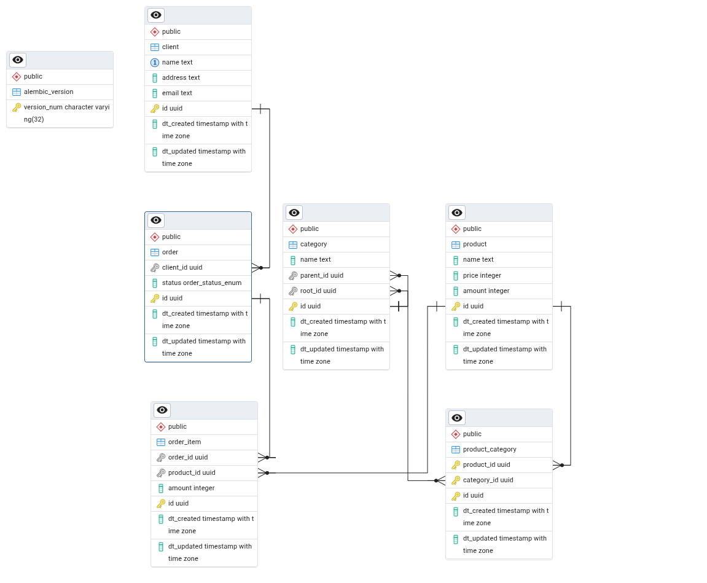

# Микросервис для работы с категориями товаров и заказами

## Требования
- `Python 3.13`
- `Poetry`
- `Docker`

# Установка зависимостей

```commandline
 poetry install
```

# Активация виртуального окружения

```commandline
 poetry env use <path to python.exe>
 poetry env activate
```

### Запуск

Запуск базы данных
```commandline
 make db
```
Запуск миграций базы данных
```commandline
 make migrate head
```
Запуск микросервиса
```commandline
 make run
```

# 1. Даталогическая схема базы данных



# 2. SQL запросы

## 2.1. Получение информации о сумме товаров заказанных под каждого клиента

```sql
SELECT 
    c.name,
    SUM(oi.amount) AS total_amount
FROM 
    client c
JOIN 
    "order" o ON o.client_id = c.id AND o.status = 'done'
JOIN 
    order_item oi ON oi.order_id = o.id
GROUP BY 
    c.id, c.name;
```
Реализован по пути [category_tree/utils/client/database.py](./category_tree/utils/client/database.py) в функции get_clients_totals.

## 2.2. Найти количество дочерних элементов первого уровня вложенности для категорий номенклатуры

```sql
SELECT 
    parent.id,
    parent.name,
    COUNT(child.id) AS children_count
FROM 
    category AS parent
LEFT JOIN 
    category AS child ON child.parent_id = parent.id
GROUP BY 
    parent.id, parent.name;
```
Реализован по пути [category_tree/utils/category/database.py](./category_tree/utils/category/database.py) в функции get_category_children_counts.

## 2.3. Топ-5 самых покупаемых товаров за последний месяц

### 2.3.1. Реализация запроса

```sql
SELECT 
    p.name AS product_name,
    c.name AS root_category_name,
    SUM(oi.amount) AS total_sold
FROM 
    product p
JOIN 
    order_item oi ON oi.product_id = p.id
JOIN 
    "order" o ON oi.order_id = o.id
JOIN 
    product_category pc ON pc.product_id = p.id
JOIN 
    category c ON c.id = pc.category_id
WHERE 
    o.dt_created >= CURRENT_DATE - INTERVAL '30 days'
    AND o.status = 'done'
    AND c.parent_id IS NULL
GROUP BY 
    p.id, p.name, c.id, c.name
ORDER BY 
    total_sold DESC
LIMIT 5;
```
Реализован по пути [category_tree/utils/product/database.py](./category_tree/utils/product/database.py) в функции get_top_products_last_month.

### 2.3.2. Анализ запроса и базы данных
Возможные проблемы производительности:

- Большое количество JOIN'ов ресурсоемко.

- Используются таблицы в которых потенциально может быть большое количество записей, и требующие полного сканирования таблицы.

- Группировка по двум столбцам из разных таблиц может потреблять много ресурсов.

Варианты оптимизации:
    
1. Добавить индексы для условий фильтрации.
2. Денормализация данных:
    - Добавление столбца с названием корневой категории в таблицу товаров.
    - Отслеживание статуса заказа в каждом order_item и фильтрация по столбцу dt_updated из order_item вместо dt_created из order.

# 3. Добавление товара в заказ
Ручка реализована в [category_tree/endpoints/order.py](./category_tree/endpoints/order.py) в функции add. Логика работы с базой данных реализована в [category_tree/utils/order/database.py](./category_tree/utils/order/database.py) в функции add_order_item.

#### Логика работы
1. Проверяем, есть ли товар в базе данных:
    - Если товар есть и достаточно, то добавляем товар в заказ
    - Если товар есть и его не достаточно, то взвращаем ошибку
    - Если товара нет, то возвращаем ошибку
2. Проверяем наличие order_id:
    - Если order_id есть:
        - сочетание order_id и product_id уже существует, то увеличиваем количество товара в заказе
        - сочетание order_id и product_id еще не существует, то добавляем товар в заказ с нужным количеством
    - Если order_id нет, но есть client_id, то создаем заказ и добавляем товар в него
    - Если order_id и client_id нет, то возвращаем ошибку
3. Уменьшаем количество доступного товара в базе данных
4. Возвращаем получившийся order_item
